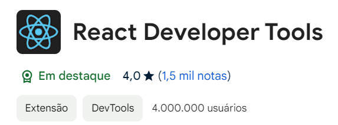
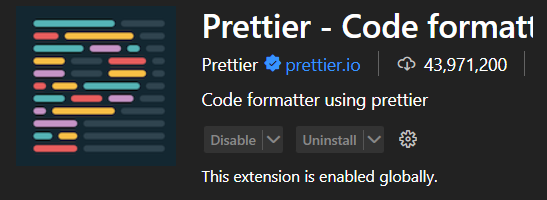
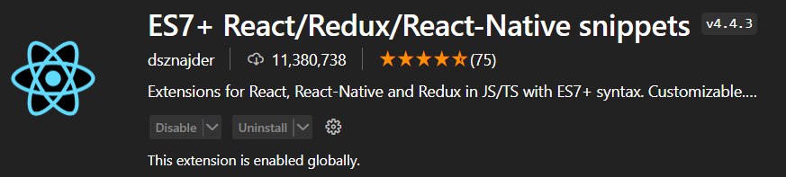
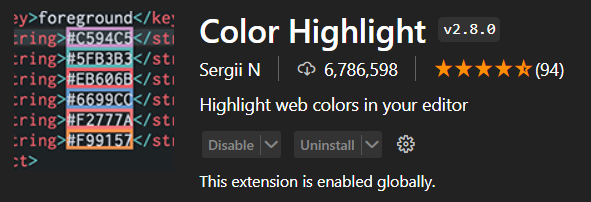
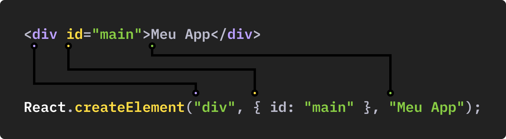

<div style="display: flex; justify-content: center;">
    
</div>

<h2 style="text-align:center; color: yellow">Extensões Navegador</h2>



<h2 style="text-align:center; color: yellow">Extensões Visual Studio Code</h2>






# Adicionando React ao meu arquivo HTML

[React Installation](https://react.dev/learn/installation)

## Código para adicionar React ao HTML

```html
<!-- Carrega o React, React Dom e Babel -->

<script src="https://unpkg.com/react@18/umd/react.development.js"></script>
<script src="https://unpkg.com/react-dom@18/umd/react-dom.development.js"></script>

<!-- Não use isso em produção: -->
<script src="https://unpkg.com/@babel/standalone/babel.min.js"></script>
```

```html
<!DOCTYPE html>
<html lang="pt-br">
  <head>
    <meta charset="UTF-8" />
    <meta name="viewport" content="width=device-width, initial-scale=1.0" />
    <title>React para Iniciantes</title>

    <!-- Carrega o React, React Dom e Babel -->
    <script src="https://unpkg.com/react@18/umd/react.development.js"></script>
    <script src="https://unpkg.com/react-dom@18/umd/react-dom.development.js"></script>

    <!-- Não use isso em produção: -->
    <script src="https://unpkg.com/@babel/standalone/babel.min.js"></script>
  </head>

  <body>
    <div id="app">App</div>
    <!-- Precisa indicar para o Babel que ele deve transpilar o código -->
    <script type="text/babel">
      // Cria um componente chamado App
      // O componente retorna JSX e por isso
      // o Babel irá transformar o mesmo
      function App() {
        return <div>Meu App</div>;
      }

      // Renderiza o componente App no elemento que tiver id = app
      ReactDOM.render(<App />, document.getElementById("app"));
    </script>
  </body>
</html>
```

## Anotações

<h3 style="color: #00BDEC">JSX</h3>

- Arquivos `JSX`: Eles não podem ser lidos pelo navegador. Você precisa de um transpilador para converter JSX para JavaScript.

<h3 style="color: #00BDEC">React Element</h3>

- Todo elemento React é criado com a função createElement. O Babel é o responsável por transformar o elemento criado com JSX (que se parece com HTML) em funções de React.

```javaScript
function App() {
  return <div id="container">Meu App</div>;
}
// É transformado em:
function App() {
  return React.createElement('div', { id: 'container' }, 'Meu App');
}
```



<h3 style="color: #00BDEC">Componentes</h3>

- Permitem você dividir a sua interface em pequenos elementos. São criados através de funções que retornam elementos React.

```javascript
// Function Component
const Button = () => {
  return <button>Comprar</button>;
};
```

- O principal motivo de criarmos componentes é para podermos compor a interface com diversos componentes que podem ser reutilizados.

```javascript
const Button = () => {
  return <button>Comprar</button>;
};

const MainNav = () => {
  return (
    <nav>
      <a href="#">Link 1</a>
      <Button />
    </nav>
  );
};

const App = () => {
  return (
    <div>
      <MainNav />
      <Button />
    </div>
  );
};
```

- Utilizamos as {} para executar expressões de JavaScript e mostrar o resultado no DOM.

```javascript
const Produtos = () => {
  const produto1 = "Camisa";
  const produto2 = "Bermuda";

  return (
    <div>
      <button>
        Comprar {produto1} - R$ {Math.random()}
      </button>
      <button>
        Bermuda {produto2} - R$ {Math.random()}
      </button>
    </div>
  );
};
```

## Bundler

- Agrupa (bundle) o código do seu aplicativo

- Permite definirmos os componentes em diferentes arquivos para melhor organização

- Facilita a importação de código externo instalado via NPM

- `ESBuild (Recomendado)`, Rollup, Parcel, Turbopack, `Webpack() => Mais antigo e o mais lento. `

## Transpiler

- Transforma JSX return <div></div> em funções de React React.createElement()

- Transforma JavaScript novo const em JavaScript antigo var

- Babel, SWC, ESBuild

# Criação de um aplicativo React

### Vite

- Cria um ambiente de desenvolvimento já configurado e otimizado para a criação de aplicativos com React.

- Na pasta que deseja instalar:

  ```javascript
   npm create vite@latest . (O ponto serve para indicar ao instalador para instalar os arquivos no atual diretório, se omitida ele vai pedir um nome para o diretório que vai criar com os arquivos.j)
   npm install
  ```

#### Comandos

- Inicia o desenvolvimento:
  `npm run dev`
- Cria a build final
  `npm run build`

<a href='https://vitejs.dev/'> Vite</a>

### Create React App

- É o mesmo princípio do Vite, mas é mais lento (usa webpack) e está gradativamente em desuso.

<a href='https://create-react-app.dev/'> Create React App</a>

## Modo Estrito

- Sem o modo estrito

```javascript
ReactDOM.createRoot(document.getElementById("root")).render(<App />);
```

- Com o modo estrito

```javascript
ReactDOM.createRoot(document.getElementById("root")).render(
  <React.StrictMode>
    <App />
  </React.StrictMode>
);
```

## JSX

- JavaScript XML / Extension. Estende a sintaxe do JavaScript, introduzindo elementos como XML que são convertidos em funções de React.

```javascript
const App = () => {
  return <button>Comprar</button>;
};
```

- É transformado em

```javascript
const App = () => {
  return React.createElement("button", null, "Comprar");
};
```

## Atributos - Casos Especiais

- O caso especial mais comum é o atributo class. Pelo fato de class ser uma palavra reservada do JavaScript, o JSX resolveu mudar o nome para evitar conflitos. O correto é className. Além dele existe o htmlFor.

```javascript
const App = () => {
  return <div className="grid">Origamid</div>;
};

const App = () => {
  return (
    <form>
      <label htmlFor="nome">Nome</label>
      <input type="text" id="nome" />
    </form>
  );
};
```

## camelCase

- Atributos com nomes compostos devem ser utilizados como camelCase. Exemplo: autoplay vira autoPlay.

```javascript
const App = () => {
  return <video autoPlay />;
};
```

## Expressões/Variáveis

```javascript
const App = () => {
  const nome = "André";
  return <p>{nome}</p>;
};
```

```javascript
const App = () => {
  const ativo = true;
  return <p className={ativo ? "ativo" : "inativo"}>Estoque</p>;
};
```

- Também posso atribuir JSX direto a uma constante/variável

```javascript
const Titulo = <h1>Meu título</h1>;

const App = () => {
  return <div>{Titulo}</div>;
};
```
